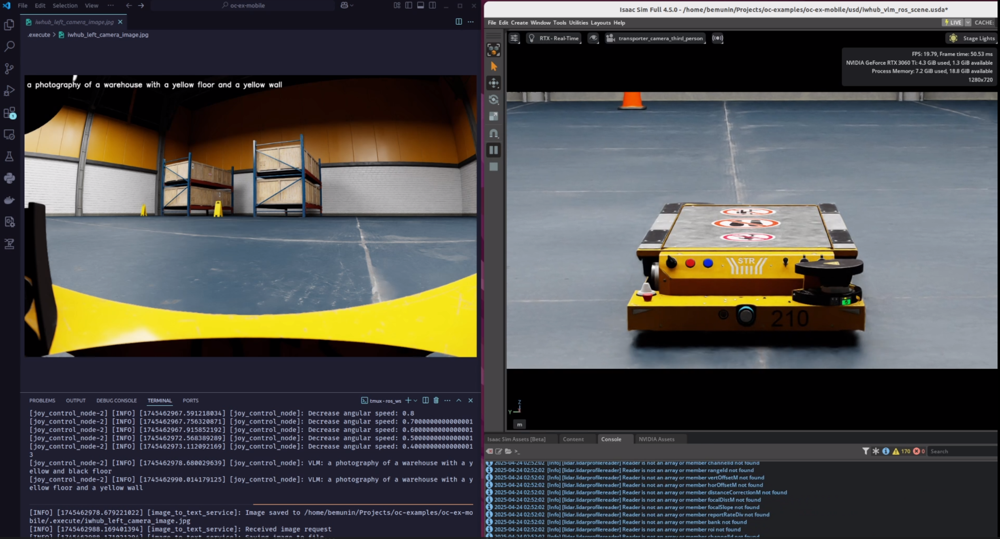

# Mini Project: Joy Control + VLM



This mini project showcases a custom joystick control system and a simple perception engine in NVIDIA Isaac Sim. It includes the following features:
- Control iwhub robot using Logitech F710 joypad in Nvidia Isaac Sim with customized joystick input handling.
- A basic Visual Language Model (image-to-text) example integrated as a ROS 2 service.
- Abitlity to change cameras between CCTV and robot's cameras in the scene by pressing the X and B button on joypad. 

## Getting Started

### Install Isaac Sim 4.5
Follow step-by-step Isaac sim workstation installation guide with local asset setup from this [tutorial](https://medium.com/@be.munin/speed-up-nvidia-isaac-sim-using-local-assets-a-complete-installation-guide-4121d823ec69)

### Install ROS2 Humble
Follow [ROS and ROS2 Installation](https://docs.isaacsim.omniverse.nvidia.com/latest/installation/install_ros.html) from Nvidia Isaac Sim offical doc

### Setup Isaac Sim ROS workspace
Clone this repo https://github.com/isaac-sim/IsaacSim-ros_workspaces and source it as ROS2 overlay by adding this line in .zshrc or .bashrc.

### Install Huggingface
- Install transformer via pip. [See this guide](https://huggingface.co/docs/transformers/en/installation)
  
- Install huggingface-cli for downloading the model. [See this guide](https://huggingface.co/docs/huggingface_hub/main/en/guides/cli).

### Setup This Project
```
## Clone project repo
git clone https://github.com/bemunin/oc-ex-mobile

## Download image-to-text model
cd ./oc-ex-mobile
huggingface-cli download Salesforce/blip-image-captioning-large --local-dir ./.models/blip-image-captioning-large

## Build ROS2 Workspace
cd ros_ws
rosdep install -i --from-path src --rosdistro humble -y
colcon build
```
### Run Simulation
- Open isaac sim (using alias)
    ```
    is
    ```
- Open file: `usd/iwhub_vlm_ros_scene.usda`
- Click Play to Run simulation


### Run ROS2

- Run joy_control_node and vlm service.
    ```
    ## launch joy_control node in another terminal
    ros2 launch oc_teleop joy_control_launch.py

    ## run vlm service in another terminal
    ros2 run oc_vlm image_to_text_service

    ```
- If you want to change vlm service inference device, run this command (no need to rerun image_to_text_service):
  ```
   ros2 param set /image_to_text_service device <cpu|gpu|serverless_gpu>

    ```
    ** serverless_gpu has not yet implemented.